# **Studiora – Premium Student ERP Management System**

> **Studiora** is an enterprise-level, royal-themed School Management System designed to streamline academic and administrative workflows with a premium user experience.

---

# **Aesthetic & Design Philosophy**

Unlike traditional cluttered ERP systems, **Studiora** follows a **Royal & Classy Design Philosophy** using:

- **Deep Forest Green**
- **Muted Gold**
- **Minimal and distraction-free layouts**

The interface is crafted to provide a luxurious, professional, and intuitive experience for administrators, teachers, and students.

---
## 📸 System Preview

### 👑 The Royal Dashboard
The command center features dynamic stats, real-time analytics, and a dark-themed calendar.
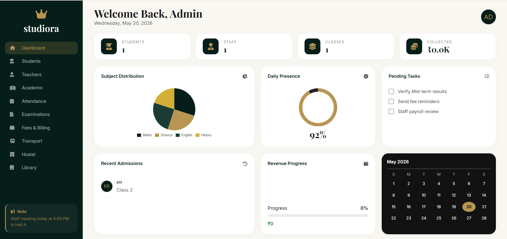

### 👥 User Management (Students & Faculty)
Featuring professional directories with "Eye-icon" digital profile cards.
<p align="center">
  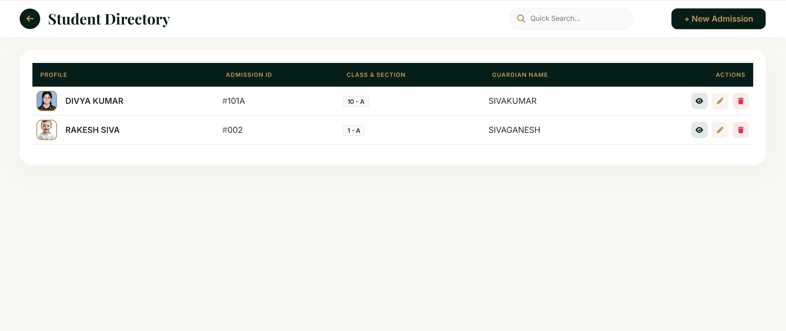
  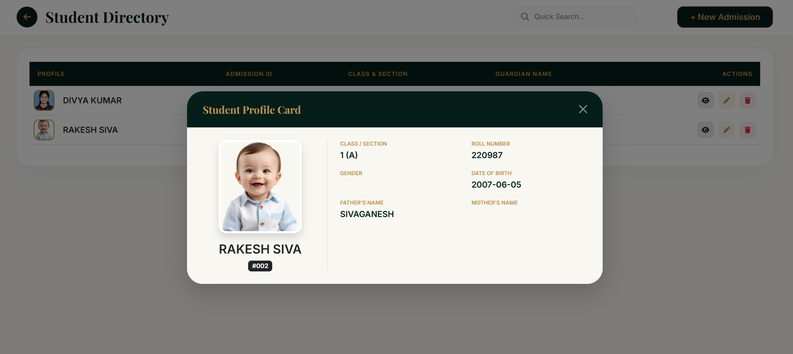
</p>
<p align="center">
  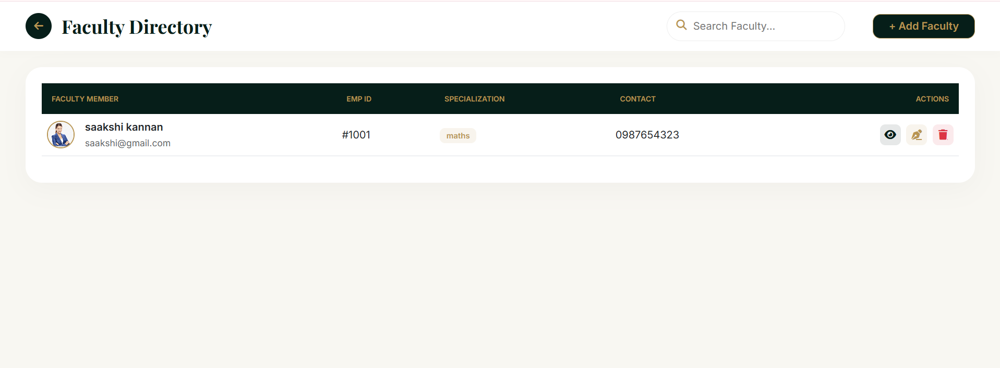
  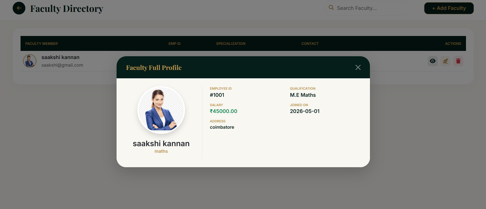
</p>

### 💰 Finance & Luxury Billing
A banking-style ledger with digital invoices and printable payment certificates.
<p align="center">
  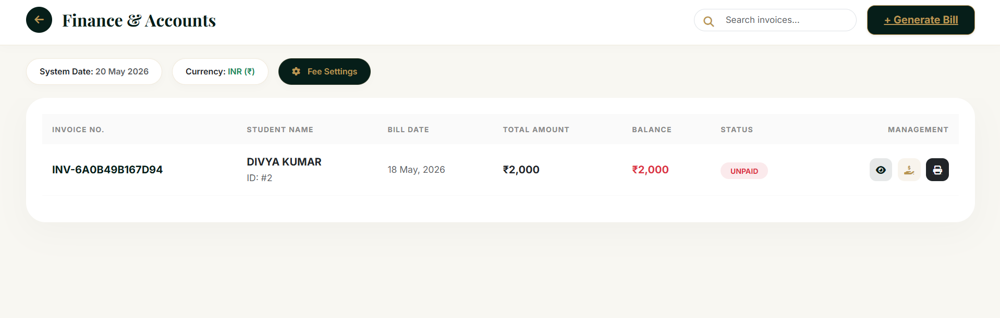
  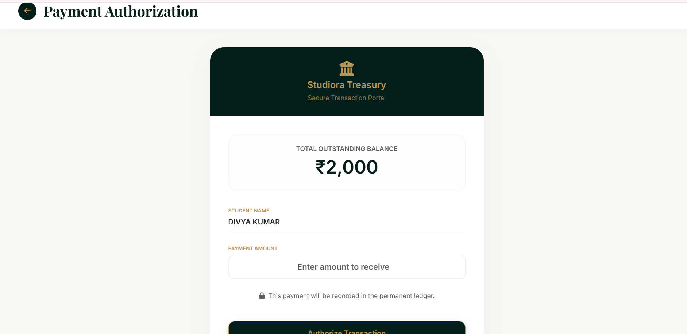
</p>
<p align="center">
  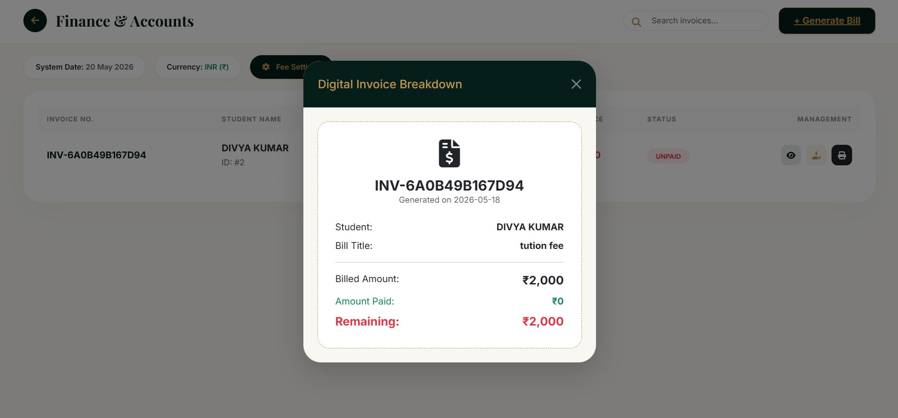
</p>

### 📅 Academic Hub & Evaluation
Managing class structures, weekly timetables, and secure marks entry.
<p align="center">
  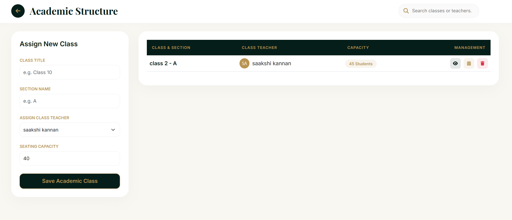
  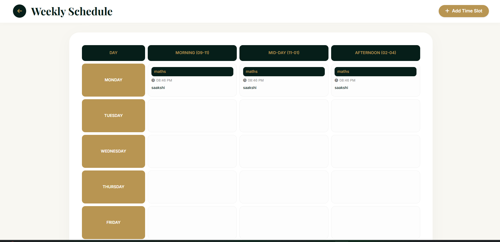
  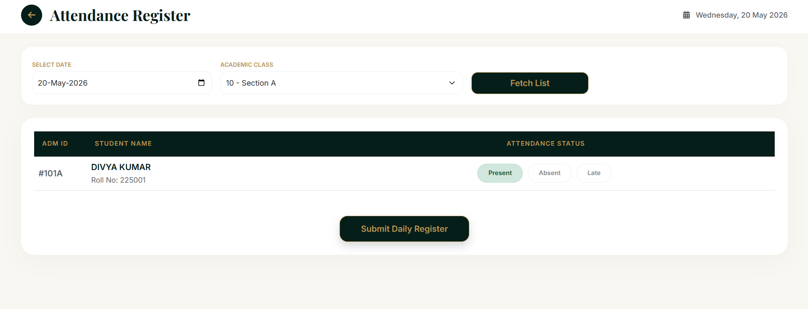
</p>
<p align="center">
  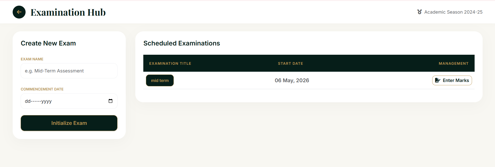
  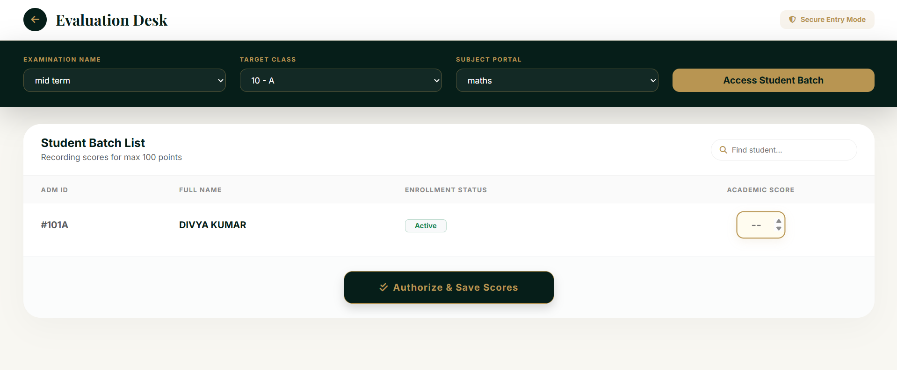
</p>

### 🚐 Logistics (Hostel, Transport & Library)
Full management of student residency, transit passes, and the knowledge treasury.
<p align="center">
  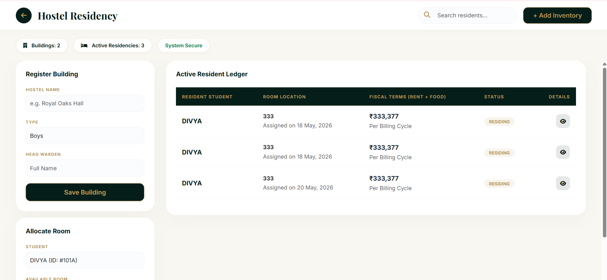
  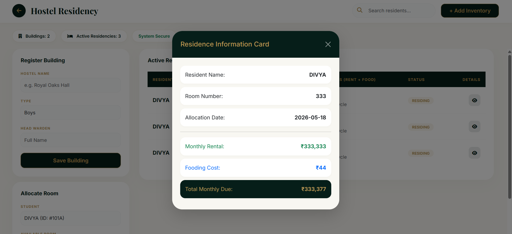
</p>
<p align="center">
  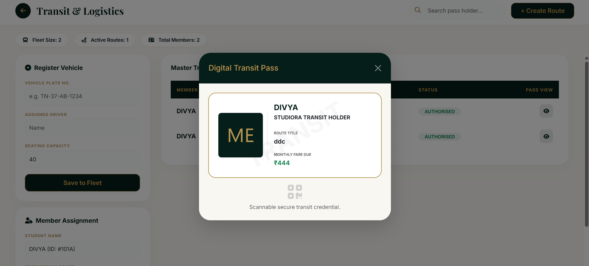
  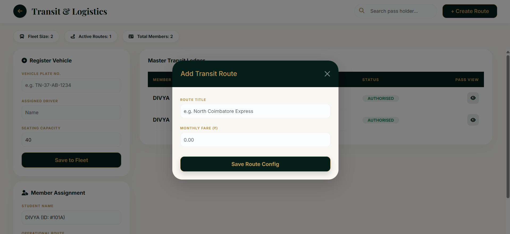
</p>
<p align="center">
  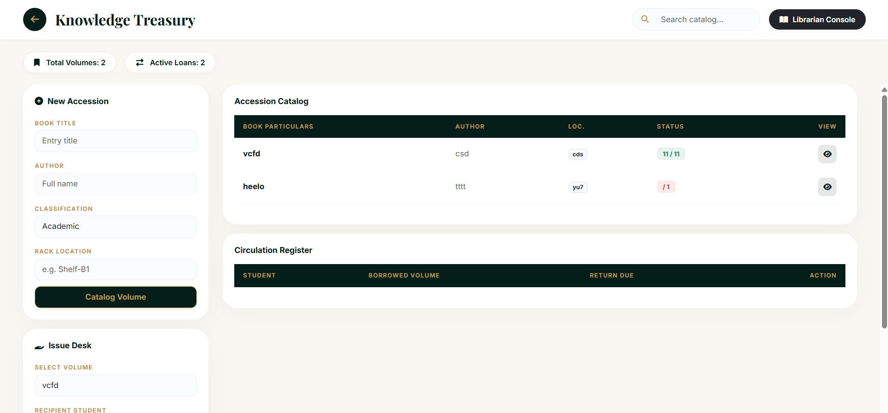
  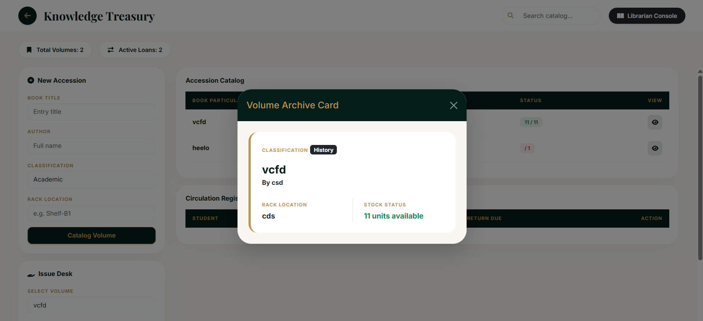
</p>

---

# **Core Features**

## **Dynamic Command Center (Dashboard)**

- **Real-time analytics** for students, faculty, classes, and revenue
- **Pie Charts and Donut Charts** powered by **Chart.js**
- Productivity tools:
  - To-Do List
  - Recent Admissions
  - Dark-themed Calendar

---

## **User Management**

### **Student Directory**
- Complete CRUD operations
- Premium profile card view
- Real-time search and filtering

### **Faculty Management**
- Teacher profile management
- Qualification tracking
- Professional credential records

---

## **Academic Hub**

- Class and section configuration
- Seating capacity management
- Premium card-based timetable system

---

## **Examination & Evaluation**

- Spreadsheet-style marks entry
- Secure evaluation desk
- Automated printable report cards

---

## **Finance & Billing System**

- Banking-style finance ledger
- Digital invoice generation
- Payment status tracking
- Premium printable receipts
- Digital watermark support

---

## **Logistics & Infrastructure**

### **Transit & Logistics**
- Vehicle management
- Route tracking
- Digital transit passes

### **Hostel Residency**
- Building and room management
- Residency profile cards

### **Knowledge Treasury**
- Full-featured library management
- Book cataloging and circulation tracking

---

# **Tech Stack**

## **Backend — PHP (CodeIgniter 3)**

- **MVC Architecture**
- High maintainability
- Lightweight and fast execution

---

## **Database — MySQL**

- Relational database structure
- Optimized queries
- Scalable student data handling

---

## **Frontend — HTML5, CSS3, JavaScript**

### **Libraries & Tools Used**
- **Bootstrap 5**
- **Chart.js**
- Custom Royal Theme UI

---

# **Advantages**

- Clean and premium user experience
- Reduced administrative workload
- Automated academic and billing workflows
- Secure role-based access system
- Real-time visibility into records and finances

---

# **Installation & Setup**

## **Prerequisites**

- XAMPP / WAMP / LAMP
- PHP 7.4 or higher
- MySQL

---

# **Steps to Run**

## **1. Clone the Repository**

```bash
git clone https://github.com/yourusername/Studiora-ERP.git
```

## **2. Move Project Folder**

Place the project inside:

```bash
C:/xampp/htdocs/
```

## **3. Setup Database**

- Open **phpMyAdmin**
- Create a database named:

```bash
studiora_db
```

- Import:

```bash
database/studiora_db.sql
```

## **4. Configure Application**

### **Update Database Credentials**

```bash
application/config/database.php
```

### **Update Base URL**

```bash
application/config/config.php
```

## **5. Run the Project**

Open:

```bash
http://localhost/studiora/
```

---

# **Author**

## **Divya P S**
**Full Stack Developer **

> *"Education is the most powerful weapon which you can use to change the world."*  
> — Nelson Mandela

---

# **Support**

If you like this project, give it a star on GitHub.
